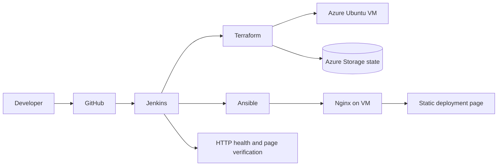
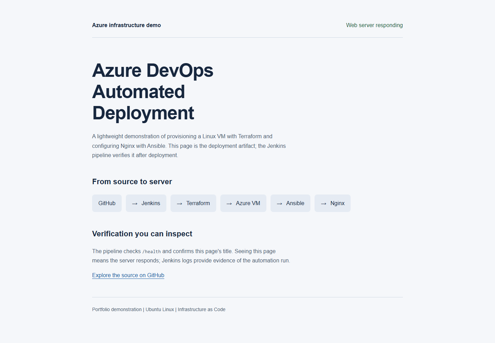

# Azure DevOps Automated Deployment

Provision an Azure Linux VM, configure Nginx and deploy a verifiable static page through Terraform, Ansible and Jenkins.

[](https://github.com/rehmatwadii/final-devops-project/actions/workflows/ci.yml)

## Overview / Why This Project Exists

A small end-to-end infrastructure automation example with clear boundaries: Jenkins orchestrates, Terraform provisions, Ansible configures and Nginx serves. It demonstrates a reproducible deployment workflow without pretending to be a production platform.

## Features

- Azure resource group, network, subnet, static public IP, NIC and Ubuntu 24.04 VM.
- Password authentication disabled; SSH restricted to an operator-supplied IPv4 CIDR.
- Public HTTP demo endpoint and `/health` response.
- Portable public-key input and Azure credentials supplied outside Git.
- Azure Storage remote state with locking, separate from application resources.
- Saved Terraform plan with Jenkins approval before applying changes.
- Dynamic Terraform outputs, bounded SSH readiness checks, idempotent Ansible modules and HTTP verification.

## Architecture



Jenkins runs on a separate Linux agent. The target VM hosts Nginx, not Jenkins. GitHub Actions validates source without Azure credentials; it does not deploy. HTTP is intentional for this demo; TLS is not configured.

## Tech Stack

Terraform 1.9+, AzureRM 4.x (locked provider version), Azure, Ubuntu Linux, Ansible, Jenkins Pipeline, SSH, Nginx and GitHub Actions.

## How It Works / Infrastructure Workflow

Terraform obtains authentication from ARM environment variables, creates the VM and outputs its address and username. Jenkins uses those outputs to wait for SSH, then Ansible installs Nginx, copies the configuration and sample page, starts the service and checks local health. Jenkins separately checks public health and the page title.

Resource identities are retained where possible, but names and the VM image changed. Review any plan against existing infrastructure carefully: replacements may occur. Historical state must be recovered privately and migrated before managing an existing deployment; never apply blindly after deleting a local state copy.

## Quick Start

Use a Linux workstation or WSL with Terraform, Python 3.12, SSH and curl. Azure deployment creates billable resources and requires your own subscription; no cloud deployment was performed during this modernization.

1. Create a separate Azure Storage account/container for Terraform state. Enable private access and grant the deployment identity Storage Blob Data Contributor on that container, plus appropriate resource provisioning permissions. Keep the state backend outside this project's resource group.
2. Copy `terraform/backend.hcl.example` to ignored `terraform/backend.hcl`; fill the actual state account settings.
3. Copy `terraform/terraform.tfvars.example` to ignored `terraform/terraform.tfvars`; replace the documentation-only CIDR with your workstation's public egress IP `/32` and select an available region/size.
4. Generate an SSH key if needed. Use your own private key locally; pass only its public part to Terraform.

```bash
python3 -m venv .venv
. .venv/bin/activate
pip install -r requirements-dev.txt
export ARM_CLIENT_ID="your-client-id"
export ARM_CLIENT_SECRET="your-client-secret"
export ARM_SUBSCRIPTION_ID="your-subscription-id"
export ARM_TENANT_ID="your-tenant-id"
export TF_VAR_ssh_public_key="$(cat ~/.ssh/devops_key.pub)"
terraform -chdir=terraform init -backend-config=backend.hcl
terraform -chdir=terraform fmt -check
terraform -chdir=terraform validate
terraform -chdir=terraform plan -out=deploy.tfplan
# Review the plan before applying:
terraform -chdir=terraform apply deploy.tfplan
export VM_IP="$(terraform -chdir=terraform output -raw public_ip_address)"
export VM_USER="$(terraform -chdir=terraform output -raw admin_username)"
export SSH_KEY="$HOME/.ssh/devops_key"
export WORKSPACE="$PWD"
export ANSIBLE_CONFIG="$PWD/ansible/ansible.cfg"
sh scripts/deploy.sh
sh scripts/verify.sh
terraform -chdir=terraform output -raw application_url
```

For interactive Azure CLI authentication, run `az login` and set ARM_SUBSCRIPTION_ID instead of supplying a service principal. Provider/resource registration permissions depend on your subscription.

## Environment / Variables

| Input | Purpose |
|---|---|
| ARM_CLIENT_ID, ARM_CLIENT_SECRET, ARM_TENANT_ID, ARM_SUBSCRIPTION_ID | Azure identity/subscription |
| TF_VAR_ssh_public_key | OpenSSH public key text |
| ssh_allowed_cidr | Egress IPv4 CIDR, /24 or narrower; prefer /32 |
| project_name, location, vm_size, admin_username | Portable infrastructure settings |
| backend.hcl | State account, container and key; Azure AD authentication |

Never paste real credentials into tracked files or command transcripts.

## CI/CD Pipeline

Create a Jenkins Pipeline from SCM pointing to this repository's `Jenkinsfile`. Provide a Linux agent labelled `linux` with Terraform, Ansible, SSH, curl and a trusted Git checkout. Install Pipeline and Credentials Binding plugins. Configure these credentials:

| Jenkins credential ID | Kind / contents |
|---|---|
| ARM_CLIENT_ID | Secret text |
| ARM_CLIENT_SECRET | Secret text |
| ARM_SUBSCRIPTION_ID | Secret text |
| ARM_TENANT_ID | Secret text |
| terraform-backend | Secret file matching backend.hcl.example |
| vm-ssh-public-key | Secret file containing the public key |
| vm-ssh | SSH username with private key matching the public key |

Set SSH_ALLOWED_CIDR to the agent's egress IP `/32`. All runs for this infrastructure must use the same remote backend key. Stages: checkout → init → format/validate → saved plan → human approval → apply → output retrieval → SSH/deploy → HTTP verification. Concurrent builds of this job are disabled; remote state locking also protects Terraform writes. Do not run another deployment workflow against the same infrastructure while a plan is awaiting approval. No destroy stage exists.

## Testing

```bash
terraform -chdir=terraform fmt -check
terraform -chdir=terraform init -backend=false
terraform -chdir=terraform validate
ansible-playbook --syntax-check -i localhost, ansible/install_web.yml
yamllint -c .yamllint .
python scripts/check_project.py
sh -n scripts/plan.sh
sh -n scripts/deploy.sh
sh -n scripts/verify.sh
```

Validation initialization disables the backend and does not provision resources. Deployment readiness and idempotence require an actual Azure target. See [validation](docs/VALIDATION.md) for executed checks and limitations.

## Security Practices

Current state files, keys, environment files and local backend settings are ignored. Historical state remains in Git history: see [security](SECURITY.md). SSH is CIDR-restricted and password authentication disabled. The demo uses `ssh-keyscan` to trust the first observed host key, then enforces that key during the run; this is trust on first use, not authenticated host identity. For stronger assurance supply a host key verified through an independent Azure console channel. State storage should have least-privilege access and backups. Jenkins logs/plans can contain infrastructure details; restrict job access. Public HTTP is a demo limitation.

## Cleanup

Only when intentionally retiring the deployed resources, use the same identity, variables and remote backend:

```bash
terraform -chdir=terraform plan -destroy -out=destroy.tfplan
terraform -chdir=terraform apply destroy.tfplan
```

Review the destroy plan first. Do not remove the separate state storage until resources are destroyed and retention needs are satisfied.

## Screenshots / Demo



[Mobile view](docs/screenshots/local-mobile.png)

See [capture notes](docs/SCREENSHOTS.md). A local page screenshot demonstrates its UI only, not an Azure deployment. Capture Jenkins stages and the deployed URL after a real run; redact account identifiers, IPs and credentials.

## Future Improvements

Add TLS/domain configuration, independently authenticated host keys and a real Azure deployment smoke test. Keep the workload small; a Kubernetes cluster is unnecessary for a static demo.

## Engineering Takeaways

State is sensitive operational data, not source code. Output names form an interface between Terraform and deployment automation. A plan/approval/apply flow makes infrastructure changes reviewable. Idempotent configuration and explicit health verification provide evidence beyond a successful command exit.

## Author

[rehmatwadii](https://github.com/rehmatwadii)

[Delivery report](docs/DELIVERY.md) includes the audit, changes, validation, GitHub presentation and suggested commits.

## Repository Structure

The final source-file listing below excludes dependencies and local state/provider directories.

```text
final-devops-project/
|-- .github/
|   `-- workflows/
|       `-- ci.yml
|-- ansible/
|   |-- files/
|   |   `-- default.conf
|   |-- ansible.cfg
|   `-- install_web.yml
|-- app/
|   `-- index.html
|-- docs/
|   |-- screenshots/
|   |   |-- local-demo.png
|   |   `-- local-mobile.png
|   |-- DELIVERY.md
|   |-- SCREENSHOTS.md
|   |-- SECURITY-AUDIT.md
|   `-- VALIDATION.md
|-- scripts/
|   |-- check_project.py
|   |-- deploy.sh
|   |-- plan.sh
|   `-- verify.sh
|-- terraform/
|   |-- .terraform.lock.hcl
|   |-- backend.hcl.example
|   |-- main.tf
|   |-- outputs.tf
|   |-- terraform.tfvars.example
|   |-- variables.tf
|   `-- versions.tf
|-- .gitattributes
|-- .gitignore
|-- .yamllint
|-- CONTRIBUTING.md
|-- Jenkinsfile
|-- README.md
|-- SECURITY.md
`-- requirements-dev.txt
```
